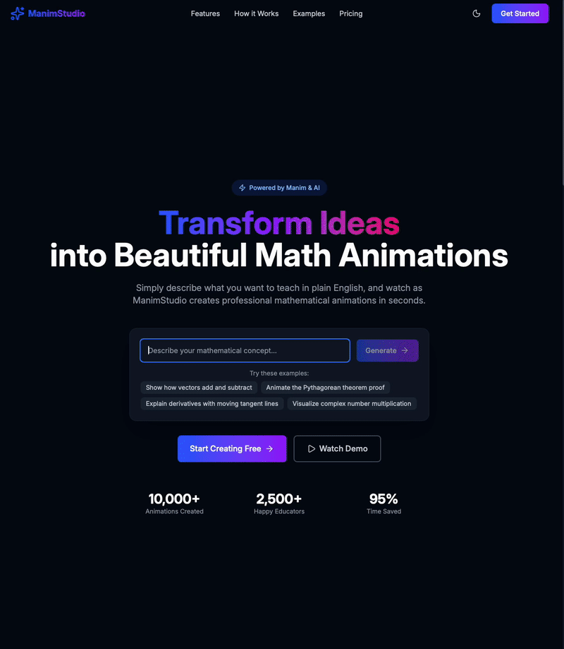

# ManimStudio - AI-Powered Mathematical Animations

Transform mathematical concepts into beautiful animations using natural language. ManimStudio combines the power of AI with the Manim animation library to create professional mathematical visualizations from simple text descriptions.

## 🎥 Demo



*Watch ManimStudio generate mathematical animations from natural language descriptions in real-time.*

## 🎬 Features

- **Natural Language to Animation**: Simply describe what you want to visualize
- **Real-time Generation**: Watch as your mathematical concepts come to life
- **Professional Quality**: Powered by Manim, the same library used by 3Blue1Brown
- **Web-Based Interface**: Easy-to-use interface with live progress tracking
- **Example Library**: Browse pre-generated animations for inspiration

## 🚀 Quick Start

### Prerequisites

- Python 3.8 or higher
- Node.js 16 or higher
- Manim dependencies (LaTeX, ffmpeg, etc.)
- OpenAI API key

### Step 1: Install System Dependencies

#### macOS

```bash
# Install Homebrew if not already installed
/bin/bash -c "$(curl -fsSL https://raw.githubusercontent.com/Homebrew/install/HEAD/install.sh)"

# Install system dependencies
brew install python@3.11 node ffmpeg cairo pango
brew install --cask mactex  # For LaTeX support (large download ~4GB)

# Install Manim
pip3 install manim
```

#### Ubuntu/Debian

```bash
# Update package list
sudo apt update

# Install system dependencies
sudo apt install python3 python3-pip nodejs npm ffmpeg
sudo apt install texlive-full  # For LaTeX support
sudo apt install libcairo2-dev libpango1.0-dev

# Install Manim
pip3 install manim
```

#### Windows

```powershell
# Install Chocolatey if not already installed
# Then install dependencies
choco install python nodejs ffmpeg miktex

# Install Manim
pip install manim
```

### Step 2: Clone the Repository

```bash
git clone https://github.com/vivekmahendra/manim-studio.git
cd manim-studio
```

### Step 3: Backend Setup

```bash
# Navigate to backend directory
cd backend

# Create Python virtual environment
python3 -m venv venv
source venv/bin/activate  # On Windows: venv\Scripts\activate

# Install Python dependencies
pip install -r requirements.txt

# Set up environment variables
cp .env.example .env

# Edit .env and add your OpenAI API key
# nano .env  # or use any text editor
# Replace 'your-openai-api-key-here' with your actual API key
```

### Step 4: Frontend Setup

```bash
# Navigate to frontend directory (from project root)
cd ../frontend

# Install Node dependencies
npm install

# Set up environment variables
cp .env.example .env
# The default settings should work for local development
```

### Step 5: Run the Application

You'll need two terminal windows:

**Terminal 1 - Backend Server:**

```bash
cd backend
source venv/bin/activate  # On Windows: venv\Scripts\activate
python main.py
# Backend will run on http://localhost:8000
```

**Terminal 2 - Frontend Server:**

```bash
cd frontend
npm run dev
# Frontend will run on http://localhost:5173
```

### Step 6: Open in Browser

Navigate to [http://localhost:5173](http://localhost:5173) in your web browser.

## 📖 Usage

1. **Enter a Prompt**: Describe the mathematical concept you want to visualize

   - Example: "Show a sine wave from 0 to 2π"
   - Example: "Demonstrate vector addition with two 2D vectors"
   - Example: "Animate the unit circle with labeled angles"

2. **Watch Generation**: The system will:

   - Analyze your prompt
   - Generate Manim code using AI
   - Render the animation
   - Display the video in your browser

3. **View Code**: Click "View Code" to see the generated Manim code

## 🔧 Configuration

### Backend Configuration (`backend/.env`)

```env
# Server settings
HOST=0.0.0.0
PORT=8000
DEBUG=true

# Manim settings
MANIM_QUALITY=low_quality  # Options: low_quality, medium_quality, high_quality
MANIM_FPS=30
MANIM_PYTHON_PATH=/usr/bin/python3

# OpenAI settings
OPENAI_API_KEY=your-openai-api-key-here
OPENAI_MODEL=gpt-4o
OPENAI_MAX_TOKENS=4000
OPENAI_TEMPERATURE=0.3
```

### Frontend Configuration (`frontend/.env`)

```env
# API Configuration
VITE_API_BASE_URL=http://localhost:8000

# Development settings
VITE_DEV_MODE=true
```

## 🗂 Project Structure

```
manim-studio/
├── backend/
│   ├── app/
│   │   ├── api/           # API routes
│   │   ├── core/          # Core configuration
│   │   ├── models/        # Data models
│   │   └── services/      # Business logic
│   ├── prompts/           # AI prompts
│   ├── generated/         # Generated Manim scripts
│   ├── output/            # Rendered videos
│   └── requirements.txt   # Python dependencies
├── frontend/
│   ├── app/
│   │   ├── components/    # React components
│   │   ├── contexts/      # React contexts
│   │   ├── routes/        # Application routes
│   │   └── services/      # API services
│   ├── public/            # Static assets
│   └── package.json       # Node dependencies
└── README.md
```

## 🧪 Testing

### Test the Backend API

```bash
# Health check
curl http://localhost:8000/api/health

# Generate animation
curl -X POST http://localhost:8000/api/generate \
  -H "Content-Type: application/json" \
  -d '{"prompt": "Draw a simple sine wave"}'
```

### Run Frontend Tests

```bash
cd frontend
npm test
```

## 🔍 Troubleshooting

### Common Issues

**1. "Manim not found" error**

- Ensure Manim is installed: `pip3 install manim`
- Verify installation: `manim --version`
- Update `MANIM_PYTHON_PATH` in backend/.env to your Python path

**2. "OpenAI API key invalid"**

- Check your API key in `backend/.env`
- Ensure you have credits in your OpenAI account
- Generate a new key at https://platform.openai.com/api-keys

**3. "LaTeX error during rendering"**

- Install LaTeX:
  - macOS: `brew install --cask mactex`
  - Ubuntu: `sudo apt install texlive-full`
  - Windows: Install MiKTeX

**4. Port already in use**

- Backend: Change `PORT` in `backend/.env`
- Frontend: The dev server will auto-select an available port

**5. CORS errors**

- Ensure backend is running on the port specified in `frontend/.env`
- Check `CORS_ORIGINS` in `backend/.env` includes your frontend URL

### Cleaning Up

The project includes a cleanup script that safely removes all generated files, rendered videos, and cache files while preserving the directory structure.

#### Using the Cleanup Script

```bash
# Run from project root
./cleanup.sh

```

**Note**: The backend server will automatically recreate these directories when needed.

## 📚 Examples

### Simple Animations

- "Draw a parabola y = x²"
- "Show a unit circle with sine and cosine"
- "Animate vector addition"

### Complex Visualizations

- "Demonstrate the Pythagorean theorem with a right triangle"
- "Show how derivatives work using tangent lines"
- "Visualize matrix multiplication step by step"

### Educational Content

- "Explain the concept of limits in calculus"
- "Show the relationship between circles and trigonometry"
- "Demonstrate the quadratic formula geometrically"

## 🤝 Contributing

Contributions are welcome! Please feel free to submit a Pull Request.

1. Fork the repository
2. Create your feature branch (`git checkout -b feature/AmazingFeature`)
3. Commit your changes (`git commit -m 'Add some AmazingFeature'`)
4. Push to the branch (`git push origin feature/AmazingFeature`)
5. Open a Pull Request

## 📝 License

This project is licensed under the MIT License - see the LICENSE file for details.

## 🙏 Acknowledgments

- [Manim Community](https://www.manim.community/) - The mathematical animation library
- [3Blue1Brown](https://www.3blue1brown.com/) - Inspiration for mathematical visualizations
- [OpenAI](https://openai.com/) - AI-powered code generation

## 📧 Support

If you encounter any issues or have questions:

- Open an issue on [GitHub](https://github.com/vivekmahendra/manim-studio/issues)
- Check the [Manim documentation](https://docs.manim.community/)
